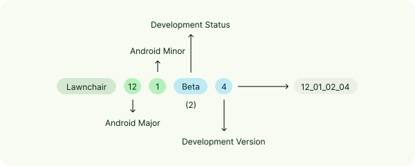

# YiTap Contributing Guidelines

<picture>
    <!-- Avoid image being clickable with slight workaround --->
    <source media="(prefers-color-scheme: dark)" srcset="res/mipmap-xxxhdpi/ic_launcher_home.png" width="100">
    
</picture>

First and foremost, welcome to the **YiTap** Contributing Guidelines!

### 💫 Bug reports & feature requests

For bug reports, please describe the bug in detail to the best of your ability
and steps on how to reproduce it. If applicable, attach log files.

For feature requests, please describe the feature you'd like to see added to YiTap.
If applicable, attach log files.

Please make sure to be civil during discussion of your contribution (refer to the [Code of Conduct](CODE_OF_CONDUCT.md))

### 🧑‍💻 Code

> [!NOTE]
> For YiTap 9 to 13, see the branches with the `9-` to `13-` prefixes respectively.

For code, it's highly recommended that you use [Android Studio](https://developer.android.com/studio),
know [Java](https://www.java.com) or preferably [Kotlin](https://kotlinlang.org/), and [Git](https://git-scm.com/).

> [!IMPORTANT]
> You can use Git to clone the repository; ensure that you include the project’s submodules using the `recursive` flag:
>
> ```
> git clone --recursive https://github.com/lingyicute/YiTap.git
> ```

To build **YiTap**, select the `lawnWithQuickstepGithubDebug` build type.
Should you face errors relating to the `iconloaderlib` and `searchuilib` projects,
run `git submodule update --init --recursive`.

Here are some contribution tips to help you get started:

-   Always make sure that you're up-to-date with **YiTap** by setting your base branch to `14-dev`.
-   Make sure your code is logical and well-formatted. If using Kotlin, see [“Coding conventions” in the Kotlin documentation](https://kotlinlang.org/docs/coding-conventions.html);
-   [The `yitap` package](https://github.com/lingyicute/YiTap/tree/14-dev/yitap) houses YiTap’s own code, whereas [the `src` package](https://github.com/lingyicute/YiTap/tree/14-dev/src) includes a clone of the Launcher3 codebase with modifications. Generally, place new files in the former, keeping changes to the latter to a minimum.

#### Additional documentation

-   YiTap Quickstep Compat Lib ([README.md](compatLib/README.md))
-   YiTap Preferences Components ([README.md](yitap/src/app/yitap/ui/preferences/components/README.md))
-   SystemUI ViewCapture ([README.md](systemUIViewCapture/README.md))
-   SystemUI Common ([README.md](systemUICommon/README.md))
-   Prebuilt Library ([README.md](prebuilts/libs/README.md))

#### Versioning scheme

As of [#4361](https://github.com/lingyicute/YiTap/pull/4361),
YiTap’s version code is separated by four parts:

<p align="center">
    <picture>
        <source media="(prefers-color-scheme: dark)" srcset="docs/version-dark.svg" width="98%">
        
        <!-- Direct the accessibility reader to read the point below --->
    </picture>
</p>

1. Android's major version
2. Android's minor version
3. YiTap's development status
4. YiTap's development version

##### Android's major & minor versions

These make up the first two parts of the version code.
For example: Android 11 will be `11_00_XX_XX` while Android 12.1 will be `12_01_XX_XX`.

##### Development status & version

The third part of the version code indicates YiTap's stability status, while the fourth part indicates the version number.

For example, Alpha 4's version code will be `XX_XX_01_04`.

See the table below detailing the release type:

| Status            | Stage |
| ----------------- | ----- |
| Alpha             | 01    |
| Beta              | 02    |
| Release Candidate | 03    |
| Release           | 04    |
