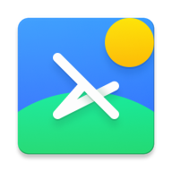

# YiTap 14～Made for My Best Xyc ❤️

<picture>
    <!-- Avoid image being clickable with slight workaround --->
    <source media="(prefers-color-scheme: dark)" srcset="res/mipmap-xxxhdpi/ic_launcher_home.png" width="100">
    
</picture>

YiTap is a free, open-source home app for Android. Taking Launcher3 — Android’s default home app — as a starting point, it ports Pixel Launcher features and introduces rich options for customization.

This branch houses the codebase of YiTap 14, which is based on Launcher3 from Android 14.

## Features

<picture>
    <!-- Avoid image being clickable with slight workaround --->
    <source media="(prefers-color-scheme: dark)" srcset="docs/device-frame.png" width="250px">
    
</picture>

-   Pixel Launcher-like UI with Material You design
-   At a Glance widget with Smartspacer support
-   QuickSwitch support
-   Global Search support
-   Icons, fonts, and colors customization
-   And more!

## Download

See the [Releases](https://github.com/lingyicute/YiTap/releases) section for the latest build. For development builds, use Github Actions builds.

## Contributing

Please visit the [YiTap Contributing Guidelines](CONTRIBUTING.md) for information and tips on contributing to YiTap.
